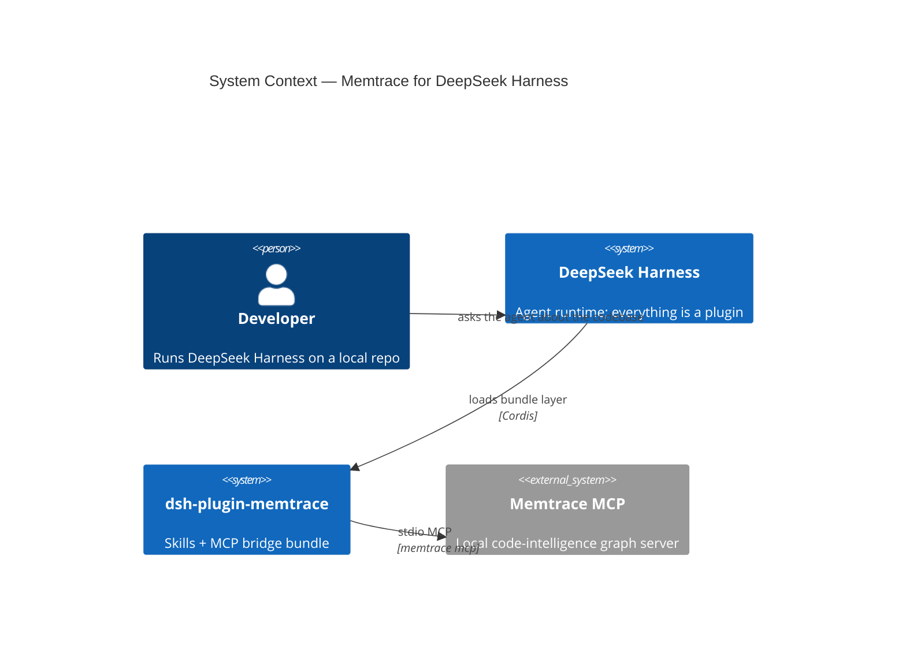

# Context and scope

C4 Level 1 — who uses this, and what it talks to.

```mermaid
C4Context
    title System Context — Memtrace for DeepSeek Harness
    Person(dev, "Developer", "Runs DeepSeek Harness on a local repo")
    System(dsh, "DeepSeek Harness", "Agent runtime; everything is a plugin")
    System(plugin, "dsh-plugin-memtrace", "Skills + MCP bridge bundle")
    System_Ext(memtrace, "Memtrace MCP", "Local code-intelligence graph server")
    Rel(dev, dsh, "asks the agent about the codebase")
    Rel(dsh, plugin, "loads bundle layer", "Cordis")
    Rel(plugin, memtrace, "stdio MCP", "memtrace mcp")
```

Scope: this package. It does not index code itself; Memtrace does.
